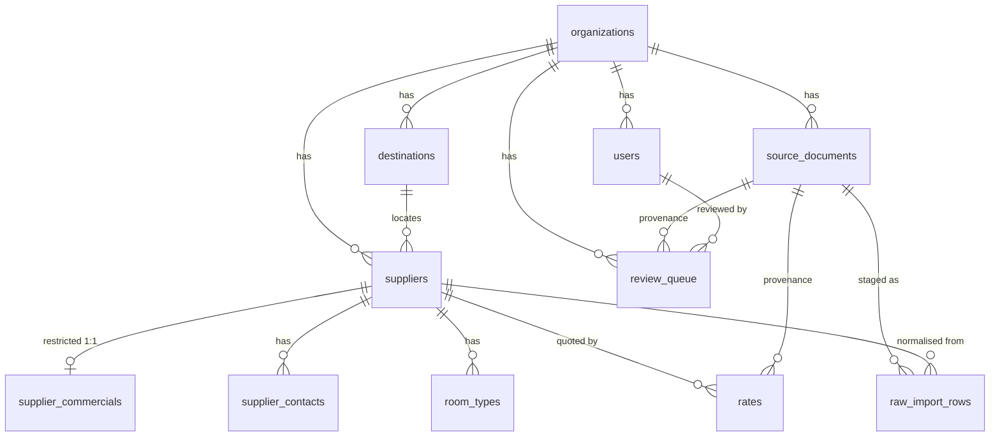

# Data dictionary

The Phase-1 canonical schema. Conventions applied everywhere:

- **UUID** primary keys (`gen_random_uuid()`); **`org_id`** on every business
  table (multi-tenant + future RLS, D-0002); `created_at` / `updated_at`
  `timestamptz`; money is `numeric(14,2)`.
- Enum columns store the **value** (e.g. `hotel`), not the Python member name.
- Migrations are the single source of truth (`db/migrations/`); this doc is the
  human-readable companion.

## ERD

## Governance & provenance

### `source_documents`
One immutable input artifact, fingerprinted. Unique on `(org_id, sha256)` so
re-ingesting identical bytes resolves to the same row.
`kind` (`SourceKind`), `origin`, `filename`, `object_key` (S3/MinIO), `sha256`,
`received_at`, `ingested_at`.

### `raw_import_rows`
Verbatim staging — one row per source row, never destroyed. Unique on
`(source_document_id, sheet_name, row_number)`.
`raw_values` (JSONB, `{column: value}`), `row_hash` (change detection),
`parser_strategy` (`ParserStrategy`), `parse_status` (`RawParseStatus`),
`normalized_supplier_id` → `suppliers` (the staging→canonical link that makes
migration idempotent and traceable).

### `tax_rules`
The GST place-of-supply rule set as data (D-0013). One row per `PlaceOfSupply`
scenario, unique per org. Seller is Uttarakhand (05); seeded by
`scripts/seed_org.py`.
`scenario` (`PlaceOfSupply`: intra_state | inter_state | international),
`treatment` (`GstTreatment`: cgst_sgst | igst | export), `gst_rate`,
`cgst_rate`, `sgst_rate`, `igst_rate` (`numeric(6,4)`), `hsn` ('998555'),
`rounding_policy` ('gross_nearest_100'), `description`, `is_default`. Resolved by
`app/services/tax.py` (pure `classify_place_of_supply` + DB lookup +
`to_pricing_tax_rule` adapter); an explicit override wins. The seller's GST
identity (`gstin`, `pan`, `gst_state_code`, `gst_state_name`) lives on
`organizations`.

### `review_queue`
The single human gate (Part 2 §4.6). Nothing on the extraction/migration path
writes canonical directly.
`entity_type` (`ReviewEntityType`), `proposed` (JSONB candidate), `existing`
(JSONB, for updates/merges), `source_document_id`, `agent_run_id` (nullable; FK
deferred to Phase 5), `confidence` `numeric(3,2)`, `status` (`ReviewStatus`,
default `pending`), `dedupe_key` (unique per org — idempotent enqueue),
`reviewed_by` → `users`, `reviewed_at`, `reviewer_notes`.

## Core catalogue

### `organizations` / `users`
Tenant + operators. `users.role` (`UserRole`); commission/margin visible only to
`owner` / `ops_manager` (D-0002). `users` unique on `(org_id, email)`.

### `destinations`
Reference data. Unique on `(org_id, name, state, country)`; `country` default
`IN`; `aliases[]` for fuzzy resolution (e.g. Kerela → Kerala).

### `suppliers`
Hotels, homestays, transport, guides, etc. (`SupplierKind`). `legal_name`,
`display_name`, `destination_id`, `category`, `property_type`, `tags[]`, `status`
(`prospect|contacted|active|blacklisted`), `notes`, `deleted_at` (soft delete —
used by merge). **No commission column** — that is isolated (below).

### `supplier_commercials` — RESTRICTED
Commission/margin, isolated in a separate table read only by owner/ops-manager
(D-0002). One row per supplier. `commission_pct`, `margin_pct`,
`commission_notes`, `criteria_of_shortlisting`.

### `supplier_contacts`
`person_name`, `role`, `phone_e164` (normalised, best-effort), `phone_raw`
(always preserved), `email` (citext), `website`, `preferred_channel`,
`is_primary`, `unusable_reason` (e.g. "no reply" — a contact is never silently
dropped).

### `room_types`
`name`, `max_adults`, `max_children`, `extra_bed_allowed`.

## Rate tables

`rates`, `transport_rates`, `activity_rates`, `guide_rates`, `misc_costs` — all
carry the **`ProvenanceMixin`**: `source_document_id`, `raw_source_text`,
`extraction_confidence` `numeric(3,2)`, `lifecycle` (`RateLifecycle`, default
`candidate`), `verified_at`, `verified_by` → `users`. A rate without provenance is
the structural exception, not the norm.

`rates` adds structured pricing (meal plan, occupancy, tax basis), a validity
window (`valid_from`/`valid_to`), and a GiST **no-overlap exclusion** so two
conflicting rates for the same room/plan/occupancy on overlapping dates are
impossible — **except** when `room_type_id` is NULL (D-0008), where overlaps are
caught by data-quality checks and human review instead.

> Phase 1 note: no rate rows are created yet. The Rajasthan migration produces
> supplier *prospects* only (D-0009); rate extraction is a later phase.

## Enum vocabularies

| enum | values |
|---|---|
| `UserRole` | owner, ops_manager, sales, accounts, readonly |
| `SupplierKind` | hotel, homestay, transport, guide, activity, facilitator, photographer, permit |
| `RateLifecycle` | raw, candidate, reviewed, verified, stale, expired |
| `ReviewStatus` | pending, approved, rejected, edited |
| `ReviewEntityType` | rate, supplier, transport_rate, merge_candidate |
| `PlaceOfSupply` | intra_state, inter_state, international |
| `GstTreatment` | cgst_sgst, igst, export |
| `SourceKind` | legacy_xlsx, vendor_email, rate_card_pdf, whatsapp_image |
| `ParserStrategy` | mechanical, assisted, bespoke, manual |
| `RawParseStatus` | pending, parsed, partial, needs_review, rejected, error |

See [DECISIONS.md](DECISIONS.md) for the *why* behind these choices and
[INGESTION.md](INGESTION.md) for how data flows through them.
